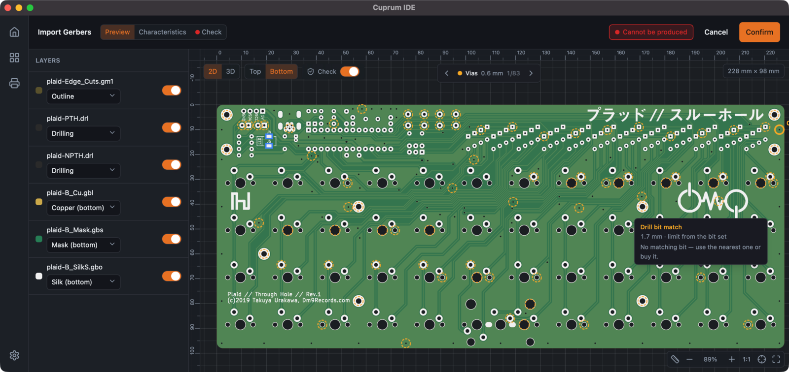

# Cuprum

[](https://github.com/fixcik/cuprum/actions/workflows/ci.yml)

**A CAM toolchain for making printed circuit boards at home — one tool for the
whole cycle, from fab package to finished board.**



Cuprum takes a Gerber/Excellon fab job and drives the machines on your bench to
produce a real PCB. It treats fabrication as a set of *processes* — each one a
(layer, machine, action) — and ties them together with shared fiducials so the
steps register against each other automatically.

The first process to land is **UV photolithography**: exposing the copper
artwork through a high-resolution UV LCD (Cuprum currently drives an
[Elegoo Saturn 4 Ultra 16K](https://www.elegoo.com/)). Drilling and edge-cut
routing on a CNC are next on the roadmap.

> Status: early, actively developed. The UV exposure pipeline works end-to-end;
> the rest of the CAM features (drill, edge-cut routing, fiducial registration)
> are on the roadmap. See [`docs/VISION.md`](docs/VISION.md).

## Approach

Cuprum plays to each tool's strengths rather than forcing one machine to do
everything:

- **Light for copper.** Exposing traces and pads is *parallel* — the entire
  artwork lands in a single flash (~90 s) regardless of trace density or how
  many boards are on the bed. A modern UV LCD also resolves a fine pitch
  (a 16K screen is ≈14×19 µm per pixel), finer than a cheap CNC mill can route.
- **CNC for the rest.** Use a mill only where light can't help: drilling holes
  and cutting the board outline.
- **Fiducials tie it together.** One set of registration marks links every
  process, so exposure → drilling and double-sided alignment become automatic.

## What's here

| Component        | Crate / dir            | What it does |
|------------------|------------------------|--------------|
| **Core library** | `crates/cuprum-core`   | Gerber parsing, rasterization (tiny-skia), composition onto the 15120×6230 screen, `.goo` encoding, and the SDCP protocol (discover / upload / expose). |
| **CLI**          | `crates/cuprum-cli`    | `cuprum` binary: a headless toolbox over the same engine as the GUI — `info`, `render` (PNG), `svg`, `3d` (glTF/STL/OBJ), `check` (DFM metrics + gate), each over a gerber file/dir or a `.cuprum` project. |
| **Project model**| `crates/cuprum-project`| The self-contained `.cuprum` project container and the recents catalog. |
| **Desktop UI**   | `cuprum-ui`            | Tauri 2 + React app: native-sharp preview, CAD-style navigation (zoom-to-cursor, pan, grid, snapping), multi-select, alignment/auto-layout, 3D board view, and one-click exposure. |

## Manufacturing checks (DFM)

Before you burn a board, Cuprum tells you whether it can actually be made on
*your* bench. It reads the fab package and measures the real manufacturing facts
— then judges each one against an editable **machine capability profile**
(min trace, min space, drill bits, panel size, …). Measurement lives in the Rust
core; the judgement lives in the UI, so editing a threshold re-evaluates
instantly without re-crunching geometry. The whole pass runs *off* the preview's
critical path, so the board stays interactive while it computes.

Each check resolves to **ok / warn / block** (plus advisory *info* for cosmetic
layers), and they roll up into a single verdict badge. Located issues are drawn
straight onto the board as side-aware markers — a bottom-side short isn't drawn
while you're looking at the top — so you can step through every offending
feature instead of hunting for it.

What it currently checks:

- **Board size** — fits the panel/work area (optionally rotated 90°), and warns
  on an open (non-stitched) outline where the measured size is only an estimate.
- **Layer stack** — copper layer count and unsupported inner layers.
- **Minimum trace width** — narrowest routed copper, per side, artefact-filtered.
- **Copper-to-copper clearance** — true geometric spacing (shorts).
- **Copper slivers** — features narrower than the trace minimum.
- **Annular ring** — plated-hole pad rings, including holes with no pad at all.
- **Drilling** — smallest hole vs. your floor, and tool sizes that don't snap to
  any available CNC bit.
- **Vias** — small holes that would need plating you don't have at home.
- **Solder-mask dams** — web width between adjacent mask openings.
- **Silk line width** — legend strokes too thin to render, judged per side.
- **Overshoot & slots** — features poking past the board edge, routed slots.

Defaults are tuned for an Elegoo Saturn 4 Ultra 16K + a hobby CNC; every
threshold is editable on the Settings page.

## Build & run

### Prerequisites

- [Rust](https://rustup.rs/) (stable, edition 2021)
- For the desktop UI: [Node.js](https://nodejs.org/),
  [pnpm](https://pnpm.io/), and the
  [Tauri 2 prerequisites](https://v2.tauri.app/start/prerequisites/) for your
  platform.

### CLI

```sh
# Build the whole workspace
cargo build --release

# Summarise a gerber file/dir or a .cuprum project
cargo run -p cuprum-cli -- info path/to/gerbers/

# Composite colour PNG / SVG preview
cargo run -p cuprum-cli -- render path/to/gerbers/ -o board.png
cargo run -p cuprum-cli -- svg path/to/board.cuprum -o board.svg

# Export the 3D board mesh (glTF/STL/OBJ)
cargo run -p cuprum-cli -- 3d path/to/gerbers/ -o board.glb --format gltf

# Measure DFM facts and gate against manufacturability limits (exit 2 on fail)
cargo run -p cuprum-cli -- check path/to/board.cuprum
cargo run -p cuprum-cli -- --json check path/to/gerbers/
```

Each command accepts a gerber file, a directory of gerbers, or a `.cuprum` project.
Run `cargo run -p cuprum-cli -- --help` for the full command list.

> Driving the printer (discover / upload / expose) currently lives in the desktop
> app; a headless hardware workflow on the project model is planned.

### Desktop UI

```sh
cd cuprum-ui
pnpm install
pnpm tauri dev
```

### Installing a release

The app updates itself: it checks GitHub Releases on launch and offers a signed
in-app update when a newer version is available.

On **macOS** the release bundles are not yet signed with an Apple Developer ID, so
the first launch of a freshly downloaded build may show an *"unidentified
developer"* warning. Bypass it once: right-click the app → **Open** → **Open**, or
strip the download quarantine flag:

```sh
xattr -dr com.apple.quarantine /Applications/Cuprum.app
```

Subsequent updates apply automatically (they go through the in-app updater, not the
browser, so they don't re-trigger the warning).

## Repository layout

```
crates/          Rust workspace (core, cli, project model)
cuprum-ui/       Tauri 2 + React desktop app
vendor/          Vendored dependencies (see Acknowledgements)
testdata/        Sample Gerber files
docs/            Vision, design system, and development notes
```

See [`docs/DEVELOPMENT.md`](docs/DEVELOPMENT.md) for contributor notes (notably:
bump the relevant disk-cache version tag when you change derived output).

## Acknowledgements

- Gerber rendering builds on
  [MakerPnP/gerber-viewer](https://github.com/MakerPnP/gerber-viewer)
  (MIT OR Apache-2.0), vendored under `vendor/gerber-viewer`.

## License

Licensed under either of

- Apache License, Version 2.0 ([LICENSE-APACHE](LICENSE-APACHE) or
  <http://www.apache.org/licenses/LICENSE-2.0>)
- MIT license ([LICENSE-MIT](LICENSE-MIT) or
  <http://opensource.org/licenses/MIT>)

at your option.

Unless you explicitly state otherwise, any contribution intentionally submitted
for inclusion in the work by you, as defined in the Apache-2.0 license, shall be
dual licensed as above, without any additional terms or conditions.
