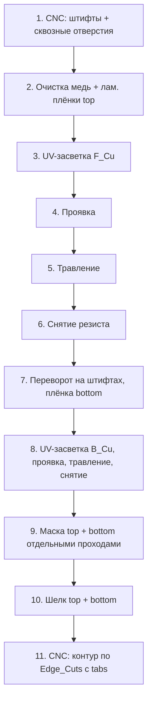
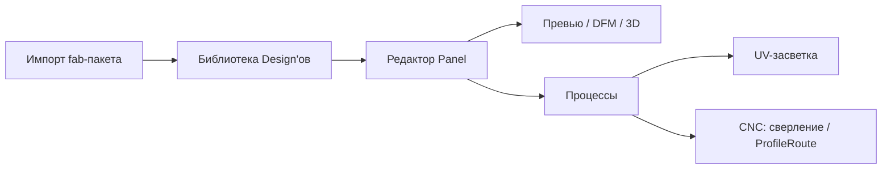

# Модель проекта Cuprum

Документ описывает **что хранит `.cuprum`-проект**, как данные текут в превью,
DFM и производственные процессы, и **на каких физико-химических ограничениях
эта модель основана**. Продуктовое видение и роадмап — в
[`VISION.md`](VISION.md). Канонические термины — в
[`GLOSSARY.md`](GLOSSARY.md); этот документ использует их без повторных
определений.

> Источники для каждого числа в этом документе перечислены в
> [«Источники»](#источники) в конце.

## Что такое проект

Проект Cuprum — это **Panel** (физическая заготовка фольгированного FR4) плюс
**ProcessStep[]** (что с ней делать). Panel хранится в `manifest.json` (поле
`panel`, схема v4 — раньше был отдельный `panel.json`); внутри лежат
`BoardInstance[]`, `ToolingHole[]` и опциональные `Fiducial[]`.

> **Сейчас vs цель.** `PanelDoc` (схема v2) уже несёт `instances[]`
> (`BoardInstance`) и `tooling_holes[]` (`ToolingHole`) как структуры данных.
> Редактор размещения, агрегированное Panel-превью и `compose`-проекция в
> Machine space — ещё впереди (см. роадмап). `Fiducial[]` пока не реализован.

### Три сущности, которые раньше путались

| Сущность | Что это | Где живёт |
|---|---|---|
| **Design** | ZIP с герберами одной платы | `manifest.designs[]` |
| **Panel** | Композиция BoardInstance'ов на FR4 | `manifest.panel` |
| **MachineProfile** | Параметры конкретного станка | `settingsStore.machineProfiles[]` |

Все последующие этапы **читают Panel**, а не отдельные Design'ы:

- 2D/3D-превью (сборка слоёв в координатах Panel)
- DFM (размер BoardInstance на Panel, зазоры между копиями, проверка по Stackup)
- UV-засветка (композ в пиксели LCD — **проекция** Panel space → Machine space)
- CNC-сверловка / раут (G-code в координатах Panel → ноль станка)
- Совмещение верх/низ (через ToolingHole + опционально Fiducial в меди)

## Иерархия сущностей

```
Проект (.cuprum)
├── Stackup                  ← copper weight, substrate thickness
├── Библиотека Design'ов     ← fab-пакеты, импортированные один раз
│   └── Design
│       ├── gerber_layers[]  ← GerberLayer с классификацией
│       │   └── apertures[]  ← X2 AperFunction (если есть)
│       ├── drill_groups[]   ← DrillGroup с DrillClass
│       └── кеш метрик       ← BoardMetrics на один Design
│
├── Panel (manifest.panel)   ← физическая заготовка FR4
│   ├── размер и origin       ← реализовано
│   ├── instances[]          ← BoardInstance (реализовано)
│   └── tooling_holes[]      ← ToolingHole (реализовано)
│
├── Process (process.json)   ← массив ProcessStep
│   └── steps[]
│
├── CalibrationLog           ← записи StepExposureTest и других замеров
│
└── cache/…                  ← производные артефакты
```

### Design

Один fab-пакет из KiCad/EasyEDA — **логическая плата** со всеми слоями и
сверловкой. Импортируется в проект и попадает в библиотеку; **не задаёт**
позицию на Panel.

- Стабильный `id` (`design-1`, …)
- `source_name` — имя исходного ZIP (для отображения)
- `gerber_layers[]` — пути внутри контейнера + `layer_type` + `apertures[]`
- `drill_groups[]` — DrillGroup с привязанным `tool_id` и `DrillClass`
- Метрики DFM считаются **на один Design** и кешируются per-Design

### BoardInstance

Одна копия Design на Panel:

| Поле | Смысл |
|---|---|
| `id` | Стабильный id копии на Panel (`inst-1`, …) |
| `design_id` | Ссылка на Design из библиотеки |
| `x_mm`, `y_mm` | Положение (origin платы в Panel space) |
| `rotation_deg` | Произвольный угол (°), `f32` — платы бывают круглые/многоугольные |
| `layer_ref` | `Top` \| `Bottom` (далее `In1..InN` для multilayer) |

> Поле называется `layer_ref`, а не `side`, чтобы при будущем multilayer не
> потребовалась миграция: `side ∈ {top, bottom}` — derived от
> `layer_ref ∈ {Top, In1..InN, Bottom}`. UI продолжает показывать «верх/низ».

На одной Panel могут быть **разные** Design'ы и **несколько копий** одного
Design'а.

### ToolingHole

Отверстие в Panel под механический штифт:

| Поле | Смысл |
|---|---|
| `id` | Стабильный id отверстия (`th-1`, …) |
| `x_mm`, `y_mm` | Положение в Panel space |
| `diameter_mm` | Диаметр отверстия |
| `role` | `registration` \| `flip` \| `unused` |

Глубина — **всегда на всю толщину FR4** (`stackup.substrate_thickness_mm`),
отдельно не хранится.

Нужны для:

1. **Перенос между станками** — UV-стол → ванна с травителем → CNC:
   заготовка садится на штифты в одних и тех же местах.
2. **Совмещение верх/низ** — после переворота нижняя сторона попадает в ту же
   систему координат, что и верхняя.

**Минимум два ToolingHole'а** фиксируют сдвиг и поворот, если они на
достаточном плече. Для flip-выравнивания — либо симметричная пара
относительно оси переворота, либо отдельные с ролью `flip`.

Промышленные SMT-линии используют **3 Fiducial в L-образном асимметричном
паттерне** для точности ±0.1 мм, но это для оптического выравнивания
пик-энд-плейс автоматов и нам не нужно. Двух ToolingHole'ов хватает, если
их разнести по диагонали заготовки.

> **ToolingHole ≠ Fiducial.** ToolingHole — сквозное отверстие в FR4,
> механика. Fiducial — крест/круг **в меди** для оптической регистрации
> (камера/глаз). ToolingHole обязателен, Fiducial опционален. См.
> [GLOSSARY.md](GLOSSARY.md).

## Stackup и материалы

Часть проекта, описывающая **физический пирог** Panel. Хранится в
`manifest.json`, потому что зависит от конкретного куска FR4, который ты
купил:

| Поле | Смысл | Дефолт |
|---|---|---|
| `copper_weight_oz` | 0.5 / 1 / 2 oz | 1 |
| `copper_thickness_um` | derived: 17 / 35 / 70 µm | 35 |
| `substrate_thickness_mm` | толщина FR4 | 1.6 |
| `copper_layers` | `[Top, Bottom]` или с inner | `[Top, Bottom]` |

**Зачем модели знать толщину меди.** От неё зависит:

- **Bloat** дорожек — компенсация подтрава
  ($35 \text{ µm Cu} → +38..51 \text{ µm на сторону}$ при EtchFactor 1:1);
- **минимальная ширина дорожки и зазора** (EtchFactor иммерсии ~1:1 →
  нельзя делать дорожку тоньше, чем толщина меди, без потери надёжности).

**Зачем толщину FR4.** Глубина сверловки ToolingHole и сквозных отверстий,
глубина ProfileRoute (+ overcut в spoil-board), оценка жёсткости при ломе
свёрл.

## Химия — вне Cuprum

Cuprum **не моделирует** концентрации, температуры и времена ванн. Дома
каждый работает с тем, что у него в гараже: один травит свежим FeCl3 в
горячей воде, другой — старым ammonium persulfate в комнатной. Заставлять
описывать рецепты в схеме — пустая работа.

Что мы делаем:

- **ProcessStep'ы Develop, Etch, Strip** — есть, юзер отмечает «выполнено».
- **EtchFactor** хранится как **один параметр на Panel** (или global default
  в settings). Пользователь подкручивает его после калибровочной платы.
- **Время засветки** — выясняется через `StepExposureTest`, сохраняется в
  `CalibrationLog` (см. ниже).

Числа вроде «1% Na2CO3 при 30 °C для проявки» полезны как стартовый
operator-визард при первом запуске Cuprum, но **не часть модели данных** —
живут в виде статической документации в onboarding-флоу, не в схеме.

## Gerber X2 — атрибуты апертур

Современный Gerber (KiCad 6.x+, EasyEDA) кладёт в файл **метаданные**: что
именно за апертура — pad под пайку, via, fiducial, контур. В тексте файла
это строки вида `%TA.AperFunction,SMDPad*%`.

Cuprum **парсит X2, если он есть** (на каждую апертуру `.AperFunction`
кладётся в `apertures[].function`), и **корректно работает без него** —
эвристика по имени слоя.

Какие функции мы понимаем сейчас:

- `SMDPad`, `ComponentPad`, `BGAPad`, `ConnectorPad` — открыты в маске,
  под пайку
- `ViaPad`, `ViaDrill` — тентуются по умолчанию (открываются в маске только
  если переопределили)
- `Fiducial` (Local / Global / Panel) — точки для оптической регистрации
- `Profile` — контур платы (без угадывания «это `Edge_Cuts`?»)
- `ComponentDrill`, `MechanicalDrill` (Tooling / Breakout) — раскладываются
  по DrillClass

**Зачем это критично:**

- **Compensation на апертуру** — на SMD-пэд можно дать меньше bloat (не
  схлопнуть зазор между ножками QFN), на дорожку — больше.
- **Маска и шелк автоматически** — не надо угадывать «что такое pad»: X2
  скажет прямым текстом. Без X2 — fallback: «всё что круг диаметром меньше
  3 мм на медном слое и совпадает с drill hit — via, остальное — pad».
- **Drill class** — `ViaDrill` идёт как PTH (если оно есть), `MechanicalDrill
  Tooling` — как Registration, всё остальное — как PTH/NPTH по эвристике.

## Системы координат

```
Board space (import)     Panel space              Machine space
─────────────────        ───────────              ───────────────
Edge_Cuts origin    →    panel origin (0,0)  →    LCD pixels / G-code zero
Y вверх, мм              Y вверх, мм              зависит от станка
```

- **Board space** — как в Gerber. Все слои, включая `B_Cu`, **хранятся в
  одной системе координат, «как видно сверху»** (Ucamco spec, KiCad). Mirror
  для нижнего слоя — обязанность Cuprum на compose, не источника.
- **Panel space** — каноническая СК проекта; все instances и pins в мм.
- **Machine space** — проекция панели на конкретный процесс:
  - UV: `compose_layout` масштабирует/сдвигает panel → экран 15120×6230,
    учитывает mirror/invert/rotate принтера. **Для instance с
    `layer_ref = Bottom`** делается **mirror по оси Y** (X-координата
    зеркалится), чтобы при перевороте заготовки на штифтах нижняя медь
    легла правильно.
  - CNC: ноль = выбранный ToolingHole; G-code в мм стола.

**Mirror axis convention.** Y-axis (X-координата зеркалится). Это согласуется
с тем, как FlatCAM/pcb2gcode по умолчанию делают `--mirror-y` для нижней
стороны.

Профиль возможностей (`workEnvelopeMm`) ограничивает **размер заготовки**, а
не «экран принтера» напрямую: если панель 200×100 мм, а экран принтера
211×118 мм — окей; если панель 200×100 мм, а CNC 300×180 мм — окей; если
панель 250×150 мм, а CNC 300×180 мм, но UV-экран 211×118 мм — Cuprum
скажет, что засветить целиком не получится, надо делить на проходы или
взять заготовку меньше.

## На диске

Контейнер `.cuprum` — это ZIP, но при открытии он **распаковывается в
рабочую директорию** (working-dir): дальше чтение/рендер идут по loose-файлам,
а `.cuprum` перезаписывается из working-dir при сохранении (autosave + ручное).
Открытие осиротевших working-dir восстанавливается (recovery), брошенные —
подчищаются (GC). Снимки манифеста для undo/redo и контрольные точки лежат в
`history/`.

| Файл | Содержимое |
|---|---|
| `manifest.json` | `name`, `description`, `designs[]`, `stackup`, `panel`, `layer_colors`, … |
| `gerbers/<design-id>/…` | Сырые gerber/drill внутри проекта |
| `history/…` | Снимки манифеста (restore points) для undo/redo |
| `process.json` | Массив шагов производства *(планируется)* |
| `calibration_log.json` | Записи калибровочных засветок *(планируется)* |
| `artifacts/{svg,metrics,preview}/…` | Производные артефакты (per-layer SVG, измерения, превью), content-keyed — едут внутри `.cuprum` |

> **Panel свёрнут в манифест** (поле `panel`, схема v4) — отдельного
> `panel.json` больше нет (был ≤ v3). `process.json` пока не реализован:
> вынесен в отдельный файл по плану, чтобы не инвалидировать манифест при
> переупорядочивании шагов.

### Жизненный цикл артефактов

Производные артефакты (`artifacts/{svg,metrics,preview}`) считаются при
показе/добавлении дизайна: карточка дизайна — «воркер», она считает per-layer
SVG + измерения + превью. Артефакты персистятся content-keyed (ключ =
`hash(source + version-тег)`) и **пакуются внутрь `.cuprum`** дебаунс-флашем
после вычисления — но **только если что-то реально посчиталось** (флаг `fresh`),
чтобы открытие уже-готового проекта не перезаписывало контейнер. Так переданный
проект ничего не пересчитывает. Старые/недосчитанные проекты досчитываются
автоматически в фоне при открытии (карточки на виде «Дизайны»). Устаревшие
артефакты (после смены типа слоя/перекраски/удаления дизайна) подметает
`artifact::gc` при упаковке. Версии артефактов сведены в `cuprum_core::artifact`;
менять вывод → поднимать соответствующий тег.

(Глобальный кеш 3D-mesh живёт отдельно — в app-cache, не в проекте.)

### Схема Panel (поле `manifest.panel`)

> Реализовано (схема v2): `PanelDoc` несёт `schema_version`, `width_mm`,
> `height_mm`, `origin_x_mm`, `origin_y_mm`, `instances[]` (`BoardInstance`),
> `tooling_holes[]` (`ToolingHole`). Ниже — JSON-форма. (Редактор и
> Panel-превью, которые это наполняют/читают, — впереди.)

```json
{
  "schema_version": 2,
  "width_mm": 200,
  "height_mm": 100,
  "instances": [
    {
      "id": "inst-1",
      "design_id": "design-1",
      "x_mm": 10,
      "y_mm": 15,
      "rotation_deg": 0,
      "layer_ref": "Top"
    }
  ],
  "tooling_holes": [
    {
      "id": "th-1",
      "x_mm": 5,
      "y_mm": 5,
      "diameter_mm": 3.0,
      "role": "registration"
    }
  ]
}
```

Роли `tooling_hole.role`: `registration` | `flip` | `unused`.

### Черновик схемы `process.json`

```json
{
  "schema_version": 1,
  "plating_strategy": "Panel",
  "steps": [
    {
      "id": "step-1",
      "layer": "drill.registration",
      "machine": "cnc-3018",
      "action": "drill",
      "params": { "tool_id": "drill-3mm" }
    },
    {
      "id": "step-2",
      "layer": "F_Cu",
      "machine": "saturn-4-ultra",
      "action": "expose",
      "params": { "exposure_time_s": 8.5 }
    }
  ]
}
```

**ProcessStep = кортеж**: `(layer, machine, action, params)`. Порядок —
индекс в массиве. Пользователь может перетасовать шаги в редакторе
процесса, удалить или добавить свои. Cuprum предлагает **дефолтный
шаблон** (см. [«Производственный пайплайн»](#производственный-пайплайн)),
но не принуждает.

Поле `plating_strategy` — `Panel` или `Pattern` — для будущей поддержки
меднения. Сейчас всегда `Panel`, никаких видимых последствий.

## Производственный пайплайн

CAM в Cuprum описывает не «как удобнее рендерить», а **реальный порядок
операций на столе**. Дефолтный шаблон для двусторонки без PTH:



| Шаг | Gerber / Panel | Станок | Примечание |
|---|---|---|---|
| Сверловка | `panel.tooling_holes` + drill (Registration + PTH) | CNC | Первый проход; всё, что нужно сквозного и регистрационного |
| Меднение | — | ванна | **Опционально**, только если делается panel plating |
| Фоторезист | — | ламинатор | Сухая плёнка, оператор сам |
| Засветка меди | `F_Cu` / `B_Cu` | UV-LCD | Двусторонка — два захода с переворотом на ToolingHole |
| Проявка | — | ванна | Оператор сам |
| Травление | — | ванна | Оператор сам |
| Снятие резиста | — | ванна | Оператор сам |
| Маска | `F_Mask` / `B_Mask` | UV-LCD | Доза в 3–10 раз больше, чем для меди |
| Шелк | `F_Silk` / `B_Silk` | UV / трафарет | После маски |
| ProfileRoute | `Edge_Cuts` | CNC | Часто **в конце**, когда плата защищена маской; **с Tab'ами** |

> **Контур не обязан быть первым.** Сверлят рано (пока плита жёсткая на
> панели), режут контур поздно (когда одиночные платы уже можно отделить).
> Оба G-code-прохода берут координаты из одной панели.

### Что в индустрии делают по-другому

- **Сверловка разделена на 2 прохода:** PTH (под меднение) и NPTH (после
  плейтинга, чтобы не заплейтить стенку). У нас MVP без PTH, поэтому всё
  идёт одним проходом, но **DrillClass** в модели уже есть, чтобы разделить,
  когда понадобится.
- **Pattern plating** даёт лучше дорожки, чем panel plating, но требует
  двух циклов резиста и tin-resist — для одной UV-LCD-машины перебор. Если
  меднение когда-нибудь появится, оно будет `Panel` (см. флаг
  `plating_strategy`).

### Меднение и травление — не снесёт?

**Коротко: нет, если меднение было *до* засветки, а травление — с резистом
на дорожках.**

Травление атакует только **открытую** медь. Участки под фоторезистом
(будущие дорожки и пятаки) сохраняют и базовую медь ламината, и
напластованный слой. Сносится медь там, где должен остаться голый FR4.

Это стандартная **panel plating** схема:

1. Тонкий медный ламинат → электроосаждение по **всей** поверхности
   (+ в отверстиях).
2. Плёнка → засветка рисунка → проявка.
3. Травник снимает «лишнее»; под резистом медь остаётся **толще**, чем была
   изначально.

Ограничения и риски:

- **Перетрав.** Травитель идёт не только вертикально вниз, но и **в
  стороны** под кромкой резиста. Этч-фактор = (вертикальная глубина) /
  (боковой подрез). Для иммерсии без агитации ≈ 1:1, с пузырьковым агитатором
  1.5–2:1, для спрей-травления — 3:1 и больше. Чем дольше травишь — тем уже
  становится дорожка. После плейтинга медь толще → травишь дольше → больше
  подрез.
- **PTH стенки.** Тоже видны травнику; при домашнем PTH нужна достаточная
  толщина осадка в отверстии, иначе стенку может пробить.
- **Меднение *после* травления** (например ENIG/HASL) — другой процесс:
  тогда травление уже прошло, финишное покрытие ложится только на пятаки.
  Это не тот «шаг 2» из таблицы.

Для **MVP без ванны** меднение и PTH пропускаются: ламинат → плёнка →
засветка → травление → сверловка (классический домашний порядок, только
сверловку переносим раньше, если нужны штифты и сквозные отверстия до
травления).

### Меднение: Panel plating vs Pattern plating (`plating_strategy`)

Если меднение когда-нибудь появится, оно может идти по двум разным схемам.
Cuprum фиксирует выбор в `process.json` как `plating_strategy: Panel |
Pattern`. Сейчас MVP — `Panel` (дефолт), Pattern зарезервирован.

**Panel plating** (то, что описано выше):

```
1. меднение всей заготовки      → толстый слой меди везде
2. фоторезист → засветка → проявка → рисунок резиста на дорожках
3. травление                    → снимает медь везде, кроме под резистом
4. снятие резиста
```

Травник работает по **базе + плейтингу одновременно**: глубина травления
вдвое больше, чем без меднения, → пропорционально больше боковой подрез,
→ больше bloat на компенсации. Дорожки получаются с покатыми краями.

**Pattern plating** (промышленный стандарт):

```
1. фоторезист на тонкую базовую медь → засветка → проявка
2. электролитическое меднение в открытые окна (только дорожки и пэды)
3. тонкий слой олова поверх меди → это будет этч-резист
4. снятие фоторезиста (под ним — голая базовая медь)
5. травление                    → снимает только тонкую базовую медь;
                                  олово защищает наращённое
6. снятие олова
```

Травник снимает **только тонкую базу** → меньше подрез, точнее дорожки. Но
процесс требует **двух циклов резиста и оловянной ванны** — для одной
UV-LCD-машины и одной ванны это перебор.

**Что это значит для модели:**

- `plating_strategy` — поле в `process.json`, дефолт `Panel`.
- Этч-bloat считается **по `copper_thickness_um + plated_copper_thickness_um`**
  для `Panel`, и только по `copper_thickness_um` для `Pattern`. Формула
  компенсации одна, но входное значение разное.
- Шаблон шагов `process.steps[]` для `Pattern` другой (два цикла резиста,
  отдельный плейтинг шаг, strip tin шаг). Дефолтные шаблоны генерятся из
  `plating_strategy` + наличия PTH.
- Для MVP **ничего из этого не реализовано** — флаг есть, шаблон один (Panel
  без меднения), Pattern → ошибка `NotImplemented`.

### Процесс в модели Cuprum

Каждый ProcessStep — запись **(layer, machine, action, params)** в массиве
`process.steps[]`:

- `drill.registration` → CNC сверление (`panel.tooling_holes`)
- `drill.pth` / `drill.npth` → CNC сверление (Excellon по DrillClass)
- `Edge_Cuts` → CNC ProfileRoute с Tab'ами
- `F_Cu` / `B_Cu` → UV Exposure (медь)
- `F_Mask` / `B_Mask` → UV Exposure (маска)
- `F_Silk` / `B_Silk` → UV Exposure (шелк)

Химия (Develop, Etch, Strip, меднение) — **вне** CAM: Cuprum даёт
чеклист и таймер, но не управляет ванной и не хранит рецепты.

## Компенсация — bloat дорожек, маска, апертуры

Компенсация — это **на сколько микрометров расширить или сузить геометрию
на гербере**, чтобы после физического процесса получился задуманный
размер. Применяется **в Cuprum при rasterisation**, не в исходных герберах.

### Bloat дорожек под травление

Подрез травителя съедает медь сбоку с обеих сторон дорожки. Чтобы получить
номинальные 100 мкм — экспонировать надо `100 + 2 × bloat`.

```
номинальный bloat ≈ copper_thickness_um / etch_factor
```

| Cu | bloat иммерсии (etch factor 1:1) | bloat спрей (3:1) |
|---|---|---|
| 0.5 oz (17 µm) | +17 µm/сторону | +6 µm/сторону |
| 1 oz (35 µm)   | +35 µm/сторону | +12 µm/сторону |
| 2 oz (70 µm)   | +70 µm/сторону | +24 µm/сторону |

Это **отправная точка** — реальный bloat зависит ещё от свежести травителя,
температуры, агитации; пользователь подкручивает после первой пробной
платы.

### Где применяется bloat

**В `compose` (растеризации)**, не в препроцессинге Gerber. Исходный
`.gbr` не модифицируется. Bloat применяется как **морфологическая
дилатация** залитых областей при растеризации слоя в пиксели LCD.

Почему так:

- **live preview**: пользователь крутит слайдер `default_um`, превью
  обновляется в реальном времени;
- **калибровка** после первой платы — пара кликов, не пере-парсить
  Gerber и не плодить файлы;
- `.gbr` остаётся каноничным — то, что в нём, это **исходный дизайн**.

Если когда-нибудь понадобится «компенсированный Gerber на экспорт»
(скажем, для отправки на JLCPCB после калибровки) — это **отдельный
шаг экспорта**, не часть основного pipeline. На структуру данных не
влияет.

### Compensation per layer + per aperture function

```
Compensation
├── default_um         ← общая поправка на слой
└── overrides[]        ← по AperFunction (если X2 есть)
    ├── SMDPad → меньше (не схлопнуть QFN)
    ├── ViaPad → среднее
    └── Profile → 0 (контур режется CNC, не травится)
```

Если в гербере **есть X2** — Cuprum применяет overrides. Если **нет** —
работает `default_um` для всего слоя.

### Compensation для маски

Маска **открывает окно** над пэдом. Если экспозиция маски смещена
относительно меди на величину больше окна — пэд частично закрыт →
непайябельно.

```
mask_expansion_per_side = pin_alignment_tolerance + manufacturing_slop
```

Для домашнего флоу с штифтами на CNC 3018 (±0.05–0.1 мм) разумная
дефолтная экспансия — **0.1–0.2 мм на сторону**. Промышленные фабы делают
0.05 мм, потому что у них оптическое выравнивание ±0.05 мм.

Per-aperture overrides — тот же механизм: BGA/QFN можно дать **меньше**
экспансии (чтобы не убрать перемычку маски между ножками), THT — **больше**.

## Калибровка

Формат `.goo` хранит **массив слоёв**, каждый со своей маской и своим
временем засветки. Это даёт нам возможность **самим сгенерировать
эквивалент Stouffer-плёнки** прямо в принтере, без покупки физического
wedge.

**Как это работает:**

Cuprum строит `.goo` с N слоями (по дефолту 21). На каждом следующем слое
маска **открывает на один квадрат больше**:

```
слой 1:   ░░░░░░░░░░░░░░░░░░░░█      ← открыт только квадрат 1
слой 2:   ░░░░░░░░░░░░░░░░░░░██      ← открыты квадраты 1+2
...
слой 21:  █████████████████████      ← открыты все 21 квадрат
```

Каждый слой светится одно и то же время (например, 1 с). После проявки:

- квадрат 21 получил **21 секунду** суммарной дозы;
- квадрат 1 — **1 секунду**.

Пользователь смотрит, **до какого квадрата** держится резист, и Cuprum
считает оптимальное время экспозиции для боевых плат.

### Другие TestPattern'ы

Помимо `StepExposureTest`, Cuprum может генерить:

- **TraceWidthTest** — параллельные линии 50/100/150/200/250 µm; смотришь,
  какие выжили после проявки + травления;
- **ClearanceTest** — пары линий с разными промежутками;
- **AnisotropyTest** — круги и линии под 45°; пиксели 14×19 µm дают
  асимметрию;
- **MaskDoseTest** — то же что `StepExposureTest`, но с более длинной
  экспозицией под маску (она требует дозу в 3–10 раз больше).

Все TestPattern — это специальный `.goo` **без BoardInstance**, чисто
калибровочная заготовка.

### CalibrationLog (в проекте, `calibration_log.json`)

Запись результата каждой калибровочной засветки:

```
CalibrationEntry
├── timestamp
├── pattern_kind             ← StepExposureTest | TraceWidthTest | …
├── pattern_params           ← N шагов, размер квадрата, …
├── time_per_step_s          ← для StepExposureTest
├── result.held_step         ← главный результат для StepExposureTest
├── result.min_feature_um    ← для шаблона ширины/зазора
├── screen_hours_used
└── notes
```

Cuprum сам **генерит TestPattern**, считает рекомендованную дозу из
результата, и сохраняет запись. Это и есть калибровочный инструмент:
«у меня новая плёнка / новый травитель / я полгода не печатал —
прогоню `StepExposureTest`, получу новое дефолтное время».

## Machine profile и tool library

### MachineProfile

В `settingsStore.machineProfiles[]`. Описывает один станок — UV-LCD или CNC.

Общие поля:

| Поле | Смысл |
|---|---|
| `name` | "Elegoo Saturn 4 Ultra" / "CNC 3018 Lunyee" |
| `kind` | `UvLcd` \| `Cnc` |
| `work_envelope_mm` | `{ x, y, z }` |

Для UV-LCD добавляются:

| Поле | Дефолт |
|---|---|
| `screen_px` | `{ x: 15120, y: 6230 }` |
| `pixel_pitch_um` | `{ x: 14.0, y: 19.0 }` |
| `orientation_rotation_deg` | 180 (для Saturn 4 Ultra) |
| `mirror_x`, `mirror_y` | false / false |
| `screen_hours_total` | runtime UV, для трекинга деградации |
| `lcd_lifetime_hours` | 500–2000 (вендорное предупреждение) |

Для CNC добавляются:

| Поле | Дефолт для CNC 3018 |
|---|---|
| `spindle` | `{ min_rpm: 0, max_rpm: 9000, controllable: false, has_pwm: true }` |
| `collet_type` | "ER11" |
| `max_shank_mm` | 7.0 |
| `runout_mm` | 0.15 (стоковый шпиндель) |
| `positional_accuracy_mm` | `{ x: 0.05, y: 0.05, z: 0.05 }` |
| `backlash_mm` | `{ x: 0.05, y: 0.1, z: 0.05 }` (Y-ось особенно) |
| `probe` | `{ kind: "manual_paper", base_height_mm: 0 }` |
| `homing` | false |
| `tool_change_protocol` | `"manual_m6"` |
| `gcode_dialect` | `"grbl_1_1"` |
| `safe_z_mm` | 5 |
| `prepend_gcode`, `append_gcode` | (свободные строки) |

**Зачем это всё.** Чтобы Cuprum не эмитил `S40000` для шпинделя, который
крутит максимум 9000 RPM; чтобы предупреждать «свёрло 0.3 мм при runout
0.15 мм — пополам ломается»; чтобы скомпенсировать backlash при коротких
переездах. И чтобы один и тот же `process.json` работал, если станок поменяли.

### Tool library

В `settingsStore.tools[]`. Машина-агностична, но привязка «какие свёрла
есть в этом коллете» — через `machineProfile.tools[]`.

| Поле | Смысл |
|---|---|
| `id` | "drill-0.8" / "endmill-1.5-pcb" |
| `kind` | `Drill` \| `EndMill` \| `VBit` \| `Engraver` |
| `diameter_mm` | 0.8 |
| `material` | `Carbide` \| `HSS` |
| `flutes` | 2 |
| `helix` | `Straight` \| `Spiral` \| `Chipbreaker` |
| `max_rpm` | 30000 |
| `recommended_rpm` | 8500 (то, что реально крутит CNC 3018) |
| `recommended_feed_mm_min` | 80 (для FR4) |
| `recommended_plunge_mm_min` | 20 |
| `recommended_doc_mm` | 0.2 |
| `expected_holes_before_replace` | 100 |

DrillGroup в Excellon-проходе ссылается на `tool_id`; Cuprum проверяет, что
такой инструмент есть и его max_rpm покрывает `recommended_rpm`.

### DrillClass — на группу, не на каждое отверстие

Excellon и так группирует hits по диаметру. Класс отверстия (`Registration`,
`PTH`, `NPTH`, `Mechanical`) хранится **на группе**, не на каждой точке:

```
DrillGroup
├── tool_id              ← инструмент из библиотеки
├── class                ← DrillClass
└── hits[]               ← позиции (x, y) в координатах панели
```

Это означает: все 0.8 мм у тебя — один класс (например, `PTH`); все 3 мм
— `Registration`. Если в одном диаметре действительно нужны два класса
(скажем, 0.8 мм есть и под пайку, и под крепёж), пользователь **разбивает
группу руками** в редакторе — Cuprum покажет «у тебя осталась группа 0.8 мм
PTH (5 шт) и появилась группа 0.8 мм NPTH (2 шт)».

Для домашнего масштаба разнести диаметры по классам — нормальная практика
(NPTH крепёж обычно 2–3 мм, явно не пересекается с компонентными 0.6–1 мм
PTH). Per-hit override в модели не нужен.

## PTH — методы соединения слоёв

В MVP **не делается** — двусторонка просто разводится с переходными
дорожками или джамперами. Но место под PTH в схеме оставлено, чтобы потом
не мигрировать.

```
PthProfile  (в проекте)
├── method
│   ├── None                 ← MVP default
│   ├── SolderedWire         ← через дырку припаянный проводок
│   ├── Rivet { id_mm, od_mm }   ← медный/латунный riveть
│   ├── ConductivePaint { kind }  ← Carbon / Silver / TinnedCopper
│   └── ElectrolessThenPlated     ← полный PTH с ванной
├── default_finished_hole_diameter_mm
├── plated_copper_thickness_um  (Option, для будущей ванны)
└── min_annular_ring_mm
```

На каждом drill hit `pth_method: Option<PthMethod>` — `None` означает
«взять project default». Это позволяет в одной плате смешать методы (часть
рукой проводком, часть рукой riveтами).

**Реальные домашние альтернативы по надёжности:** soldered wire ≈
rivet+solder > silver epoxy >> carbon ink. Carbon ink имеет сопротивление
~6 × 10⁻¹ Ω·cm — на три порядка хуже электролизной меди; не via-замена.

## ProfileRoute и Tab'ы

Когда CNC режет контур платы по `Edge_Cuts`, без мостиков плата вылетает в
середине реза и идёт в брак. Tab — это мостик, который остаётся после
прохода и потом отламывается или допиливается надфилем.

```
ProfileRoute
├── polygon                  ← polygon в Panel space
├── tool_id                  ← endmill из ToolLibrary
├── doc_per_pass_mm          ← глубина за проход
├── total_depth_mm           ← толщина FR4 + ~0.3 мм в spoil-board
└── tabs[]
    └── Tab
        ├── center_along_path_mm
        ├── width_mm           ← обычно 1–2 мм
        └── height_mm          ← обычно 0.3–0.5 мм (остающаяся высота)
```

**Авто-расстановка по дефолту.** При создании ProfileRoute Cuprum:

1. Считает периметр контура.
2. Делит на N равных дуг (N = 3 для плат до 50 мм, 4 для 50–150 мм,
   5+ для больше).
3. Для каждой дуги берёт середину как кандидата под таб.
4. Проверяет, что точка не пересекается с пэдом / дорожкой / меднением
   с минимальным зазором (например, 1 мм). Если пересекается — сдвигает
   таб на ±5 мм вдоль контура и проверяет снова.
5. Если за 5 попыток не нашёл место — пропускает (лучше меньше табов в
   нормальном месте, чем таб поверх пэда).

**Drag для коррекции.** UI редактора ProfileRoute позволяет:

- перетянуть Tab мышкой вдоль периметра,
- удалить Tab (клик + Del),
- добавить Tab щелчком по контуру,
- посмотреть в 3D-превью, где плата держится.

**G-code эмиссия.** На участках Tab'а фреза поднимается до
`total_depth - tab.height`, после Tab'а опускается обратно. Никогда не
разрезать Tab между разными Z-проходами.

## UI-поток



1. **Проект** — метаданные + Stackup + список Design'ов; кнопка «Импорт ZIP».
2. **Инспекция Design'а** (опционально) — превью/DFM одного Design до
   добавления на Panel.
3. **Редактор Panel** — главный экран:
   - холст = Panel (мм, сетка, снап);
   - drag BoardInstance'ов, multiselect, align/distribute;
   - инструмент «ToolingHole» — расставить штифтовые отверстия (мин. 2);
   - sidebar: библиотека Design'ов → «добавить на Panel».
4. **Превью** — всегда **вид Panel** (слои всех BoardInstance + ToolingHole),
   переключатель top/bottom, 2D/3D.
5. **Редактор процесса** — массив `process.steps[]`, drag для переупорядочки,
   inline-редактирование params, кнопка «Сбросить к шаблону».
6. **Запуск ProcessStep** — выбор шага + MachineProfile; вход = Panel +
   ToolLibrary.

## Реперы и регистрация — три уровня

| Маркер | Где задаётся | Для чего |
|---|---|---|
| **ToolingHole** | `manifest.panel` | Механика: штифты, переворот, перенос между станками |
| **Panel-level Fiducial** | `manifest.panel` (опционально, рядом с ToolingHole) | Оптика на уровне всей Panel (для CNC точного нуля по камере) |
| **Copper Fiducial** | Gerber X2 `.AperFunction Fiducial` (опционально) | Оптика на уровне платы (центр-по-кресту в меди) |
| **Panel origin** | `manifest.panel` | Единая СК для всех процессов |

**Сейчас обязательны только ToolingHole'ы**, остальное — опционально и
извлекается из герберов, если есть X2.

Типичный сценарий двусторонки:

1. CNC: ToolingHole'ы + сквозные отверстия.
2. (Опционально) меднение / PTH.
3. Верх: плёнка → Exposure `F_Cu` → Develop → Etch → Strip.
4. Переворот на **те же ToolingHole'ы** (роль `flip` / симметричная пара).
5. Низ: плёнка → Exposure `B_Cu` → Develop → Etch → Strip.
6. Маска и шелк — каждая сторона отдельным UV-проходом.
7. CNC: ProfileRoute по `Edge_Cuts` (отделение плат от Panel), **с Tab'ами**.

## Миграция от текущего кода

> Часть уже сделана: ✅ `imports[]` → `designs[]`, ✅ `Stackup` в манифесте,
> ✅ FR4-бланк (`manifest.panel`, схема v4). Импорт схлопнут в один приём
> (✅ `add_design_from_zip` копирует ZIP прямо в working-dir + авто-классификация;
> staging-визард удалён), есть библиотека-галерея Design'ов с per-Design
> инспектором (2D/3D + DFM + редактируемые типы слоёв) и удалением. DFM-проверка
> размера дизайна — против **размера Panel** (фолбэк на макс. рабочей зоны станка
> из настроек, пока Panel не задан); размер Panel клампится по настройкам.
> ✅ Работа с файлом проекта вынесена в модуль `document/` с централизованными
> миграциями (Value-пайплайн, `schema_version` ведущий). ✅ Заведены структуры
> `BoardInstance` / `ToolingHole`, `PanelDoc` → схема v2 (`instances[]` +
> `tooling_holes[]`), мёртвый `placements[]` удалён (манифест → схема v5).
> Остальное (редактор Panel, Panel-превью, `compose`-проекция) — впереди
> (см. Phase 1 в [`ROADMAP.md`](ROADMAP.md)).

| Сейчас | Целевое |
|---|---|
| `manifest.placements[]` (per-gerber) | ✅ Удалено (манифест → схема v5); размещение переехало в `panel.instances[]` (`BoardInstance` с `layer_ref`) |
| ✅ `manifest.imports[]` | Переименовано в `manifest.designs[]` (сущность = Design) |
| `manifest::Panel` (w/h/x/y) | ✅ Мёртвая `manifest::Panel` удалена; `PanelDoc` (схема v2) несёт `instances` + `tooling_holes` |
| `store.ts` — раскладка на LCD | Panel editor в Panel space; compose — только на export |
| ✅ `ProjectPage` — превью всех gerber import | Реализован per-Design инспектор (галерея → один Design); общий Panel-превью — впереди |
| ~ DFM «fits panel» vs board size | Сделано: размер Design vs размер Panel. Впереди: bbox **BoardInstance** на Panel |
| `capabilityProfile` | Расширить до `MachineProfile` (UV-LCD + CNC варианты) |
| — | ✅ `Stackup` в манифесте (`copper_weight_oz`, `substrate_thickness_mm`, `double_sided`) |
| — | `ToolLibrary` в `settingsStore` |
| — | `process.json` (массив ProcessStep) |
| — | `calibration_log.json` (CalibrationEntry) |
| — | Gerber X2 `.AperFunction` парсинг (fallback на эвристику) |
| `drill` плоский | `DrillGroup` с `DrillClass`: Registration / PTH / NPTH / Mechanical |
| `placement.side` | ✅ Структура `BoardInstance.layer_ref` (Top / Bottom, derived `side`) заведена; mapping на compose — впереди |
| Compensation отсутствует | `Compensation { default_um, overrides[] }` per GerberLayer |
| Tabs отсутствуют | `ProfileRoute.tabs[]` |
| `pins[]` в Panel | ✅ Заведено как `tooling_holes[]` (`ToolingHole` с `id`/`role`) |

## Решённые вопросы

1. **Панель = физическая заготовка FR4.** Размер задаётся в проекте,
   pins/instances/реперы — внутри.
2. **Двусторонка — одна панель**, instances с `layer_ref: Top` / `Bottom`,
   переворот через pins.
3. **ToolingHole** = `(x_mm, y_mm, diameter_mm, role)`; глубина =
   `stackup.substrate_thickness_mm`, отдельно не хранится.
4. **Fiducials автоматически не генерируем**: copper fiducials берём из
   Gerber X2 (если есть), panel-level fiducials добавляются вручную рядом с
   pins (опционально). Базовая регистрация — только pins, минимум 2.
5. **Кеш метрик** остаётся per-import (как сейчас, DFR); добавляется
   агрегат per-panel для проверок «помещается ли N копий».
6. **Stackup живёт в проекте**, рецепт химии — в `settingsStore` (гибрид).
7. **Gerber X2** парсим сразу, есть fallback на эвристику по имени слоя
   для старых герберов.
8. **`process.steps[]` — массив кортежей**: дефолтный шаблон + пользователь
   может переупорядочить / добавить / удалить.
9. **`plating_strategy: Panel | Pattern`** — поле в схеме, дефолт `Panel`,
   видимых последствий пока нет.
10. **Compensation применяется в `compose`** (не в Gerber-препроцессинге),
    чтобы дать live preview при подкрутке параметра и не трогать `.gbr`.
    Если когда-то понадобится «компенсированный Gerber на экспорт» —
    добавим отдельным шагом, на модель не повлияет.
11. **Calibration — multi-layer .goo, генерится Cuprum**, физический
    Stouffer wedge покупать не нужно. UI калибровки живёт **в настройках
    принтера** (свойство принтера, не проекта), история замеров —
    разворачивающийся список под текущим временем засветки.
12. **Tabs для CNC routing — авто-расстановка по дефолту, drag для
    коррекции**. При создании контурного шага Cuprum разбивает периметр
    на N равных дуг (N = 3–4), кладёт таб в середину каждой, проверяет,
    что не пересекает медь — если пересекает, сдвигает на 5 мм. UI
    позволяет перетянуть мышкой и удалить.
13. **DrillClass — на группу (per-group)**. Excellon и так группирует
    отверстия по диаметру; в каждой группе один класс на все hits. Если
    в одном диаметре смешаны два класса (NPTH + PTH) — пользователь
    разделит группу руками. Для домашнего масштаба разнести диаметры
    NPTH и PTH несложно.

## Открытые на сегодня

(Пусто. По мере появления — добавлять сюда.)

## Источники

Цифры в этом документе подтверждены следующими источниками. Где источники
расходятся — указано «диапазон» и взят медианный дефолт.

### UV-LCD photolithography

- Hackaday, *Forget The UV Resist Mask: Expose Custom PCBs Directly On
  Your SLA Printer*, 2022-08-09 — общий workflow, vat-removed,
  Photonic Etcher / Qwicktrace ссылки. <https://hackaday.com/2022/08/09/forget-the-uv-resist-mask-expose-custom-pcbs-directly-on-your-sla-printer/>
- Hackaday.io, *Qwicktrace PCB* (project 178451) — рабочие времена
  засветки 4 мин 30 с, контактный метод без стекла LCD.
  <https://hackaday.io/project/178451-qwicktrace-pcb>
- GitHub, *Andrew-Dickinson/photonic-etcher* — тулчейн растеризации в
  пиксели LCD. <https://github.com/Andrew-Dickinson/photonic-etcher>
- Liqcreate, *Elegoo Saturn 4 Ultra 16K* — pixel pitch 14×19 µm.
  <https://www.liqcreate.com/supportarticles/elegoo-saturn4-ultra-resin-16k/>
- Anycubic, *LCD Screen Lifespan* — 500–2000 часов до деградации.
  <https://store.anycubic.com/blogs/3d-printing-guides/step-by-step-how-to-replace-monochrome-lcd-screen-for-anycubic-photon-mono-x>

### Dry film photoresist

- PCBway, *Dry Film Imaging of PCB* — lamination 105–125 °C, 35–50 psi.
  <https://www.pcbway.com/blog/Engineering_Technical/Dry_Film_Imaging_of_PCB.html>
- Sedlak / pcbfab.com, *Printed Circuit Board Fabrication: Developing* —
  1% Na2CO3, pH 10.5, breakpoint правило.
  <http://pcbfab.com/developing>
- Fortex, *Stouffer 21 Step Wedge T2115* — калибровка.
  <https://www.fortex.co.uk/product/stouffer-21-step-wedge/>
- MicroChemicals, *Storage, Ageing, Refilling, and Dilution of
  Photoresists* — shelf life 12–24 мес. охлаждённого.
  <https://www.microchemicals.com/dokumente/application_notes/photoresists_storage_ageing_refilling_dilution.pdf>
- Aivon, *Mastering the Dry Film Solder Mask Exposure Process* — strip 3%
  NaOH @ 55 °C, 3 мин.
  <https://www.aivon.com/blog/pcb-knowledge/mastering-the-dry-film-solder-mask-exposure-process-a-step-by-step-tutorial/>

### Etching

- MADPCB, *Etch Factor* — определение, диапазон 1:1 (иммерсия) до 1:5.
  <https://madpcb.com/glossary/etch-factor/>
- Epec, *Etch Compensation: What it Means for Your PCB Data* — правила
  компенсации по oz меди.
  <https://blog.epectec.com/etch-compensation-what-it-means-for-your-pcb-data>
- Seychell / Massmind, *Etching with Air Regenerated Acid Cupric Chloride*
  — измерения этч-фактора с агитацией.
  <http://techref.massmind.org/techref/pcb/etch/CuCl2.htm>
- JLCPCB, *Etch Factor Control for Precise PCB Trace Width* — 11.7 µm
  bloat per side @ 1 oz, etch factor 3:1.
  <https://jlcpcb.com/blog/how-etch-factor-controls-pcb-trace-width>

### Solder mask / silkscreen

- Eternal Tech, *Dynamask 5000 TDS* — экспозиция ~150 mJ/cm² @ 350–450 nm.
  <https://eternaltechcorp.com/s/eternal_506_english.pdf>
- FarrellF, *DIY PCBs with Solder Mask*, 2014-01-17 — практический
  Dynamask DIY workflow. <http://www.farrellf.com/projects/hardware/2014-01-17_DIY_PCBs_with_Solder_Mask/>
- Sierra Circuits, *Solder Mask Clearance Rules* — индустриальный дефолт
  0.075–0.1 мм expansion.
  <https://www.protoexpress.com/blog/pcb-solder-mask-clearance-every-engineer-should-know/>

### Gerber X2 / CAM concepts

- Ucamco, *The Gerber Layer Format Specification rev 2024.05* —
  `.AperFunction` definitions. <https://www.ucamco.com/files/downloads/file_en/456/gerber-layer-format-specification-revision-2024-05_en.pdf>
- PCBSync, *What is Gerber X2?* — обзор X2 атрибутов.
  <https://pcbsync.com/gerber-x2/>
- KiCad forum, *Flipping a Gerber for milling operations* — B.Cu
  хранится в top-view, mirror — обязанность CAM.
  <https://forum.kicad.info/t/flipping-a-gerber-for-milling-operations/15817>
- PCBSync, *PCB Drill Tolerance* — IPC-2221C tolerance classes (PTH ±80
  µm, NPTH ±50 µm, press-fit ±50 µm).
  <https://pcbsync.com/pcb-hole-tolerance/>

### CNC 3018 + tools

- Lunyee, *3018 Pro Max review* — work envelope, GRBL, шпиндель.
  <https://www.lunyeecnc.com/blogs/news/3018-pro-max-review-best-budget-desktop-cnc-router-for-hobbyists>
- SainSmart blog, *How I Increased the Precision of Genmitsu CNC Router* —
  backlash на Y, фикс через пин.
  <https://www.sainsmart.com/blogs/news/how-i-increase-the-precision-of-genmitsu-cnc-router>
- PreciseBits, *Tools for PCB Prototyping* + *Carbide Drill Bits Feeds and
  Speeds* — фид/спид FR4. <https://www.precisebits.com/applications/pcbtools.htm>
- AllPCB, *Optimizing Drilling Parameters for FR-4 PCBs* — 40k+ RPM
  индустриальный таргет.
  <https://www.allpcb.com/allelectrohub/optimizing-drilling-parameters-for-fr-4-pcbs>
- FlatCAM, *Double-sided PCB workflow* — alignment pins.
  <http://flatcam.org/manual/doubleside.html>

### PTH at home

- Hackaday, *Open-Source Method Makes Possible Two-Layer PCBs With
  Through-Plating At Home*, 2021-06-11.
  <https://hackaday.com/2021/06/11/open-source-method-makes-possible-two-layer-pcbs-with-through-plating-at-home/>
- Hackaday, *DIY Through Hole Plating Like A Boss*, 2015-02-25 — copper
  rivets. <https://hackaday.com/2015/02/25/diy-through-hole-plating-like-a-boss/>
- MG Chemicals, *838AR Carbon Conductive Coating TDS* — 6.3 × 10⁻¹ Ω·cm.
  <https://mgchemicals.com/products/conductive-paint/conductive-acrylic-paints/carbon-paint/>
- KSG PCB, *Pattern Plating vs Panel Plating* — почему индустрия выбирает
  pattern.
  <https://www.ksg-pcb.com/en/pattern-plating-and-panel-plating-the-core-processes-of-printed-circuit-board-production/>

### Fiducial conventions

- Cadence, *PCB Fiducial Guidelines Improve Assembly Outcomes*, 2024 —
  3 фидушала, L-pattern.
  <https://resources.pcb.cadence.com/blog/2024-pcb-fiducial-guidelines-improve-assembly-outcomes>
- LadyAda, *Fiducial tips* — практика для DIY.
  <https://www.ladyada.net/library/pcb/fiducials.html>

---

*Ревизия 2026-06-02. Обновлять по мере фиксации новых решений.*
